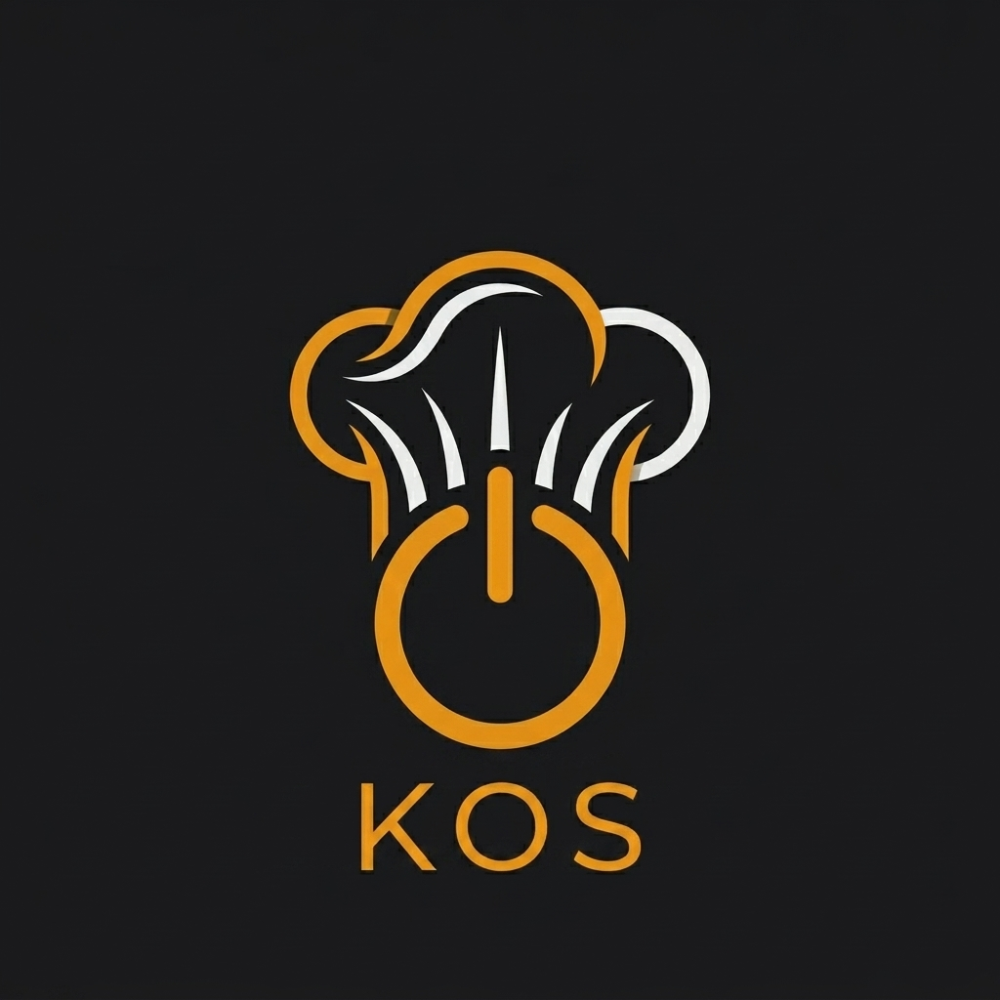

# Documento de Contexto y Especificaciones - KitchenOS

Este documento define el alcance, características, flujos, funcionalidades y arquitectura para **KitchenOS**, el sistema operativo y de gestión para talleres de cocina, restauración y pastelería en centros de Formación Profesional.

---

## 1. Introducción y Objetivos

**KitchenOS** es una plataforma diseñada para digitalizar y estructurar la dinámica diaria en los talleres de hostelería de centros educativos. Permite coordinar las tareas de alumnos y profesores bajo un entorno técnico que simula las exigencias de la industria real (normativas APPCC, control de inventario, jefatura de cocina, seguridad y mantenimiento, y evaluación continua).

### Objetivos Clave:
*   **Trazabilidad y Responsabilidad:** Registro exhaustivo de quién realiza cada acción (temperaturas, inventario, firmas de checklists).
*   **Gestión Educativa Nacional:** Vinculación de grupos con los currículos oficiales de España (TodoFP).
*   **Digitalización APPCC e Inventario:** Eliminación de registros en papel de temperaturas y de stock, facilitando la exportación a PDF.
*   **Feedback Inmediato:** Herramientas de supervisión rápida en taller para los profesores.

### Estrategia de Despliegue:
*   **Fase 1: Web App:** Desarrollo de una aplicación web responsiva (PWA / React o similar) optimizada para tablets de aula, ordenadores y dispositivos móviles.
*   **Fase 2: Compilación Híbrida:** Una vez validada y pulida la versión web, se utilizará una herramienta de compilación híbrida (como Capacitor) para empaquetarla como aplicación nativa para Android e iOS.

---

## 2. Roles y Accesos (Matriz de Permisos)

El rol de Administrador tiene control total sobre el sistema, permitiendo la creación, edición o eliminación de cualquier entidad para resolver contingencias en el aula.

| Funcionalidad | Alumno | Profesor | Administrador |
| :--- | :---: | :---: | :---: |
| **Acceso General** | Solo lectura / Operaciones asignadas | Gestión de sus grupos y talleres | **Acceso y Modificación Total** |
| **Registro de Temperaturas (APPCC)** | Registrar diario (inicio/fin) | Configurar cámaras | Crear / Editar / Borrar registros |
| **Gestión de Inventario Activo** | Modificar cantidades | Añadir/Eliminar ingredientes base | Gestionar base maestra y stock |
| **Briefing del Servicio** | Solo lectura | Crear/Editar elaboraciones y cartas | Crear / Editar / Borrar todo |
| **Checklist Jefe de Cocina** | Completar (si es asignado) | Crear/Eliminar tareas | Editar tareas y registros |
| **Checklist Finalización (Limpieza)** | Completar (si es asignado) | Crear/Editar checklists por aula | Editar checklists e históricos |
| **Gestión de Incidencias** | Crear incidencia (140 chars) | Crear / Ver / Cambiar estado | Ver / Modificar / Borrar incidencias |
| **Supervisión de Taller** | Sin acceso | Evaluar desempeño (higiene, actitud...) | Consultar y editar evaluaciones |
| **Gestión de Usuarios** | Sin acceso | Sin acceso | **Aprobar / Denegar / Editar usuarios** |

---

## 3. Modelo de Base de Datos (Propuesta Supabase / PostgreSQL)

Para soportar todas las funcionalidades, se propone el siguiente esquema relacional en Supabase:

### Tabla: `usuarios`
*   `id` (UUID, Primary Key, link a Auth)
*   `email` (VARCHAR, único)
*   `nombre` (VARCHAR)
*   `apellidos` (VARCHAR)
*   `rol` (ENUM: 'alumno', 'profesor', 'admin')
*   `estado_aprobacion` (BOOLEAN, default: false)
*   `creado_en` (TIMESTAMP)

### Tablas Académicas: `grados`, `cursos`, `modulos`, `grupos`
*   **`grados`**: `id`, `tipo` (ENUM: 'GB', 'GM', 'GS', 'CE'), `nombre` (ej. Cocina y Gastronomía).
*   **`modulos`**: `id`, `grado_id` (FK), `curso` (1, 2 o único), `nombre` (ej. Técnicas culinarias).
*   **`grupos`**: `id`, `nombre` (ej. 1º GM Cocina A), `grado_id` (FK), `curso`, `profesor_id` (FK a `usuarios`), `activo` (BOOLEAN).
*   **`alumnos_grupos`**: `grupo_id` (FK), `alumno_id` (FK a `usuarios`).

### Tablas APPCC (Temperaturas): `camaras`, `registro_temperaturas`
*   **`camaras`**: `id`, `nombre` (ej. Cámara de Verduras), `tipo` (ENUM: 'refrigeracion', 'congelacion'), `temperatura_limite` (DECIMAL, 4.0 o -18.0), `grupo_id` (FK) o `aula_id`.
*   **`registro_temperaturas`**: `id`, `camara_id` (FK), `fecha` (DATE), `momento` (ENUM: 'inicio', 'fin'), `temperatura` (DECIMAL), `usuario_id` (FK, alumno que registra), `alerta` (BOOLEAN, autocalculado si excede el límite), `creado_en` (TIMESTAMP).

### Tablas de Inventario: `inventario_maestro`, `inventario_activo`, `historial_inventario`
*   **`inventario_maestro`** (Lista oficial elaborada por profesores/admin): `id`, `nombre` (ej. Carne picada de vacuno), `categoria` (ej. Carnes), `unidad_medida` (ej. kg, litros, unidades).
*   **`inventario_activo`** (Stock real en almacenes): `id`, `ingrediente_id` (FK a `inventario_maestro`), `zona` (ENUM: 'economato', 'bodega', 'camaras'), `cantidad` (DECIMAL), `ultima_modificacion_por` (FK a `usuarios`), `actualizado_en` (TIMESTAMP).
*   **`historial_inventario`** (Trazabilidad): `id`, `ingrediente_id` (FK), `cantidad_anterior` (DECIMAL), `cantidad_nueva` (DECIMAL), `tipo_operacion` (ENUM: 'entrada', 'salida', 'ajuste'), `usuario_id` (FK), `fecha` (TIMESTAMP).

### Tablas de Briefing: `elaboraciones`, `cartas_semanales`
*   **`elaboraciones`**: `id`, `nombre`, `descripcion` (TEXT), `alergenos` (JSON o BOOLEAN array para los 14 alérgenos oficiales), `creado_por` (FK a `usuarios`).
*   **`cartas_semanales`**: `id`, `grupo_id` (FK), `fecha` (DATE, día de servicio), `elaboraciones_ids` (UUID[] o tabla intermedia).

### Tablas de Control Diario (Checklists): `jefes_cocina`, `checklist_produccion`, `checklist_limpieza`
*   **`jefes_cocina`**: `id`, `fecha` (DATE), `grupo_id` (FK), `jefe_id` (FK a `usuarios` - alumno), `limpieza_id` (FK a `usuarios` - alumno encargado de limpieza), `observaciones` (TEXT), `firmado` (BOOLEAN), `firmado_en` (TIMESTAMP).
*   **`checklist_produccion_tareas`**: `id`, `grupo_id` (FK), `tarea` (VARCHAR), `activo` (BOOLEAN).
*   **`checklist_produccion_registro`**: `id`, `jefe_cocina_id` (FK a `jefes_cocina`), `tarea_id` (FK), `completada` (BOOLEAN), `actualizado_en` (TIMESTAMP).
*   **`checklist_limpieza_tareas`**: `id`, `aula` (ENUM: 'cocina', 'pasteleria', 'sala'), `tarea` (VARCHAR), `activo` (BOOLEAN).
*   **`checklist_limpieza_registro`**: `id`, `jefe_cocina_id` (FK a `jefes_cocina`), `tarea_id` (FK), `completada` (BOOLEAN), `actualizado_en` (TIMESTAMP).

### Tabla: `incidencias`
*   `id` (UUID)
*   `usuario_id` (FK a `usuarios` - creador)
*   `tipo` (ENUM: 'averia', 'rotura', 'extravio', 'peligro', 'otro')
*   `descripcion` (VARCHAR(140))
*   `estado` (ENUM: 'pendiente', 'notificado_centro', 'resuelto')
*   `fecha` (TIMESTAMP)

### Tabla: `supervision_taller`
*   `id` (UUID)
*   `alumno_id` (FK a `usuarios`)
*   `profesor_id` (FK a `usuarios`)
*   `fecha` (DATE)
*   `uniformidad` (INTEGER, escala 1-5)
*   `higiene` (INTEGER, escala 1-5)
*   `tecnica` (INTEGER, escala 1-5)
*   `actitud` (INTEGER, escala 1-5)
*   `observaciones` (TEXT)
*   `creado_en` (TIMESTAMP)

---

## 4. Detalle de Funcionalidades y Flujos de Pantalla

### 4.1 Login y Registro (Acceso Seguro)
*   **Registro diferenciado:**
    *   Formulario donde se selecciona el rol ("Soy Alumno" o "Soy Profesor").
    *   Si es Alumno, debe seleccionar su Curso/Grupo inicial para enviar la solicitud de registro.
*   **Pantalla de Aprobación (Vista Admin):**
    *   Un panel donde el Administrador aprueba o deniega los accesos pendientes. Hasta que no esté aprobado, el usuario no puede iniciar sesión (recibe un mensaje de "Pendiente de aprobación por tu profesor/admin"). El administrador también puede modificar roles y datos de los usuarios aprobados en cualquier momento.

### 4.2 Registro de Temperaturas (APPCC)
*   **Flujo Alumno:**
    1.  Accede a "Temperaturas" (o widget de Dashboard).
    2.  Selecciona el momento ("Inicio de Clase" o "Fin de Clase").
    3.  Introduce la temperatura de cada cámara del taller asociado.
    4.  Si el valor excede el límite (ej. > 4ºC en refrigeración o > -18ºC en congelación):
        *   Se tiñe la tarjeta en **rojo** y muestra un **icono de peligro (⚠️)**.
    5.  Guarda los registros.
*   **Flujo Profesor / Admin / Exportación PDF:**
    *   Filtra registros por rango de fechas y grupo/aula.
    *   Genera una tabla visual e interactiva.
    *   Botón "Exportar PDF" que genera un informe oficial APPCC descargable con firmas e incidencias de temperatura. El administrador o profesor puede corregir registros incorrectos si es necesario.

### 4.3 Inventario Activo
*   **Flujo Alumno (Modificación de stock):**
    1.  Selecciona la zona (economato, bodega o cámaras).
    2.  Busca el ingrediente. Solo puede seleccionar de la lista maestra (ej. "Carne picada de vacuno", no puede escribir un nombre nuevo libremente).
    3.  Registra una entrada (+ cantidad) o salida (- cantidad).
    4.  El sistema registra: `Usuario X` | `Entrada de 2 kg` | `Fecha/Hora`.
*   **Flujo Profesor / Admin (Gestión de lista maestra):**
    *   Pantalla para añadir nuevos ingredientes maestros (nombre, categoría, unidad de medida estándar).
    *   Permite eliminar ingredientes maestros no utilizados. El administrador puede saltarse las restricciones y modificar cantidades directamente sin generar una transacción estándar.

### 4.5 Briefing del Servicio
*   **Flujo Alumno:**
    *   Visualiza la carta planificada para el día actual o navega por los días de la semana.
    *   Al pulsar en una elaboración, se abre una ventana modal con:
        *   Descripción breve de la elaboración (explicada por el profesor).
        *   Iconos visuales de los **14 alérgenos de la UE** (destacando los activos y apagando los ausentes).
*   **Flujo Profesor / Admin:**
    *   Panel de gestión de elaboraciones (nombre, descripción, alérgenos).
    *   Calendario semanal donde asigna elaboraciones a cada día para configurar el menú.

### 4.6 Checklists de Clase (Jefe de Cocina y Limpieza)
*   **Jefe de Cocina (Mise en Place / Producción):**
    *   El profesor/admin asigna al alumno "Jefe de Cocina" del día.
    *   El alumno asignado entra en su panel y ve las tareas del checklist de producción.
    *   Marca las tareas a medida que se completan.
*   **Encargado de Limpieza (Finalización de clase):**
    *   Se asigna un alumno responsable de limpieza.
    *   Selecciona el aula/taller correspondiente.
    *   Completa el checklist de limpieza específico configurado para ese taller.
*   **Cierre y Firma:**
    *   Ambos checklists disponen de un apartado de **Observaciones** para registrar detalles relevantes de la sesión.
    *   Botón **"Guardar y firmar"**: Al pulsarlo, el registro se congela (bloquea la edición) con un timestamp y el usuario que lo firma. El administrador tiene el permiso único de desbloquear o editar un checklist firmado en caso de error administrativo.

### 4.7 Apartado de Incidencias
*   Abierto a todos.
*   **Formulario sencillo:**
    *   Desplegable: Avería, Rotura, Extravío, Peligro, Otro.
    *   Descripción: Caja de texto de hasta **140 caracteres** (estilo microblogging).
    *   El sistema asocia la fecha, hora, usuario y vincula al profesor del grupo para avisarle en su panel. El administrador puede reasignar incidencias o borrarlas del historial.

### 4.8 Supervisión Taller (Solo Profesores / Admin)
*   **Evaluación Interactiva Rápida:**
    *   El profesor ve la lista de alumnos en taller.
    *   Al lado de cada alumno hay un botón `+`. Al pulsarlo, se despliega una tarjeta de evaluación rápida de la sesión.
    *   Calificaciones en escala 1-5 en: *Uniformidad*, *Higiene*, *Técnica de trabajo* y *Actitud*.
    *   Permite añadir un comentario breve opcional.

---

## 5. Diseño Visual, UX y Disposición de Pantalla Principal

**KitchenOS** se estructura visualmente bajo un estilo **Neo-SaaS / Dark UI Premium**, optimizado para el contraste en talleres con luz artificial intensa y para su uso en tablets/móviles.

### 5.1 Estructura de Logos Institucionales y Dinámicos
*   **Encabezado Global:**
    *   **Lado izquierdo:** Logo oficial de la *Consejería de Educación de la Junta de Castilla y León* (de forma estática en la barra de navegación superior).
    *   **Lado derecho:** Logotipo del *Centro Educativo* (dinámico, cargable al principio de cada curso por el administrador o profesor) junto al perfil del usuario activo.
    *   **Centro:** Nombre e icono oficial de **KitchenOS**.

### 5.2 Estructura del Dashboard Principal (Bento Grid)
Al iniciar sesión, el usuario accede a una pantalla principal modular estructurada como un **Bento Grid** con accesos directos e información clave en tiempo real según su rol:

#### A. Vista del Alumno:
1.  **Módulo Carta del Día (Briefing):** Muestra el plato estrella del menú de hoy con indicadores rápidos de alérgenos principales. Acceso al menú semanal al pulsar.
2.  **Módulo Mis Checklists:** Si el alumno ha sido designado hoy como *Jefe de Cocina* o *Encargado de Limpieza*, este módulo se destaca con borde de acento en ámbar mostrando las tareas completadas (ej. "Mise en place: 3/8 completado"). Si no tiene rol asignado, aparece como "Sin rol activo hoy".
3.  **Módulo Registro de Temperaturas:** Acceso rápido para tomar las temperaturas de "Inicio" o "Fin" de clase. Indica con un punto verde o rojo si ya se han cumplimentado hoy.
4.  **Módulo Inventario Activo:** Caja de búsqueda rápida de ingredientes y visualización rápida del stock en la zona actual del alumno.
5.  **Módulo Incidencias:** Acceso rápido para abrir un parte en 140 caracteres. Muestra el estado de la última incidencia enviada por el alumno (Pendiente / En Proceso / Resuelta).

#### B. Vista del Profesorado:
1.  **Módulo Supervisión Taller (Evaluación Rápida):** Lista compacta de los alumnos del grupo activo. Al hacer clic sobre el nombre o en el botón `+`, se despliega una tarjeta de evaluación rápida de la sesión.
2.  **Módulo Control de Checklists:** Estado del checklist de producción (Jefe de Cocina) y limpieza (Encargado de Limpieza) en tiempo real. Indica quién es el alumno responsable hoy y si el checklist ha sido firmado y guardado.
3.  **Módulo Incidencias del Taller:** Lista de incidencias abiertas en el taller hoy. Los profesores pueden clicar para cambiar su estado o reasignarlas.
4.  **Módulo Briefing Semanal:** Programador rápido de menús. Muestra la carta del día con botón de edición rápida.

### 5.3 Fundamentos del Diseño:
*   *Fondo general:* Oscuro profundo mate (`#09090b` / `#121214`).
*   *Superficies de tarjetas (Bento Grid):* Gris neutro técnico oscuro (`#18181b` / `#1e1e24`).
*   *Bordes:* Líneas ultrafinas de 1px en gris suave (`#27272a` / `#2d2d34`).
*   *Acentos:* Color ámbar técnico cálido (`#f59e0b` o `#e0a96d`) para botones principales e interactivos, y rojo vibrante (`#ef4444`) para advertencias y alertas de temperatura.
*   *Tipografía e Iconografía:* Tipografía *Geist* o *Inter* importada de Google Fonts y set de iconos de línea fina (tipo Lucide).

---

## 6. Siguientes Pasos de Planificación

1.  **Fase 1:** Configuración inicial del proyecto (Vite / React o Vanilla SPA), diseño de estilos globales e integración con Supabase.
2.  **Fase 2:** Autenticación de usuarios, flujo de login/registro diferenciado y panel de aprobación del Administrador.
3.  **Fase 3:** Módulo de Registro de Temperaturas (APPCC) y exportador a PDF.
4.  **Fase 4:** Inventario Activo (Lista maestra y flujo de transacciones).
5.  **Fase 5:** Briefing de elaboraciones, menús y alérgenos.
6.  **Fase 6:** Checklists diarios de Jefatura de Cocina, limpieza de talleres y firmas.
7.  **Fase 7:** Incidencias y panel de Supervisión rápida para profesores.
